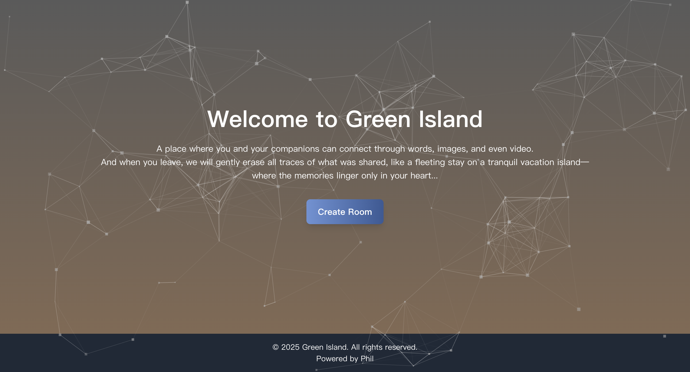

# 🌿 Green Island - Real-Time Chat & Video Call App

Green Island is a modern real-time **chat and video call platform** that prioritizes privacy and security. Imagine stepping onto a secluded island where conversations disappear once you leave—just like a peaceful getaway. ✨

---

## 🚀 Features

### 💬 Real-Time Chat
- Instant text messaging with a smooth user experience.
- Supports Markdown for better text formatting.
- Secure, private, and anonymous messaging.

### 🎥 Video Call (Powered by **Agora**)
- High-quality, **low-latency** video calls.
- Multi-user video conferencing support.
- **Screen sharing** feature for presentations or collaborations.

### 🎨 Elegant & Responsive UI
- Minimalist design with **Tailwind CSS** for a sleek and modern look.
- Fully **responsive** for desktop, tablet, and mobile devices.

### 🔒 Privacy Protection
- All chat messages and media **automatically disappear** after the conversation ends.
- **No data tracking**, ensuring a safe and private communication space.

---

## 🖼️ Preview

### 🔹 Home Page


### 🔹 Chat Room Interface


### 🔹 Video Preparing Room Interface


### 🔹 Video Call Room Interface


---

## 🛠️ Tech Stack

- **Frontend**: Next.js, React, Tailwind CSS, TypeScript
- **Backend**: Node.js, Express, Prisma, Socket.IO
- **Database**: SQLite (for development) or PostgreSQL (for production)
- **WebSocket**: Real-time messaging powered by **Socket.IO**
- **Video Streaming**: **Agora SDK** for stable video/audio communication
- **Deployment**: Render (for both frontend and backend)

---

## 🎯 Getting Started

### 📌 Prerequisites
- **Node.js** v16+ installed
- **NPM** or **Yarn** installed
- An **Agora App ID** for video calls

### 🔧 Installation

1️⃣ **Clone the Repository**
```sh
git clone https://github.com/your-username/green-island.git
cd green-island
```

2️⃣ **Install Dependencies**
```sh
npm install
```

3️⃣ **Set Up Environment Variables Create a `.env.local` file in the root directory and add:**
```sh
NEXT_PUBLIC_AGORA_APP_ID=your_agora_app_id
NEXT_PUBLIC_BASE_URL=your_backend_url
```
4️⃣ **Start the Application**
- Start the **frontend**:
    ```sh
    npm run dev:client
    ```

- Start the **backend**:
    ```sh
    npm run dev:server
    ```

### 🌍 Deployment

#### ✅ Deploy on Render

This project is optimized for deployment on Render.

1. Deploy **frontend**:
    - Add frontend repository to Render.
    - Set NEXT_PUBLIC_BASE_URL as your backend URL.
2. Deploy **backend**:
    - Add backend repository to Render.
    - Use **Prisma** for production instead of SQLite.
    - Ensure **WebSockets are enabled**.

### 📢 Contact & Contribution

If you have any feedback, feature requests, or issues, feel free to:

- Open an issue or submit a pull request on GitHub.
- Reach out via email: xuyuwei19940909@gmail.com.